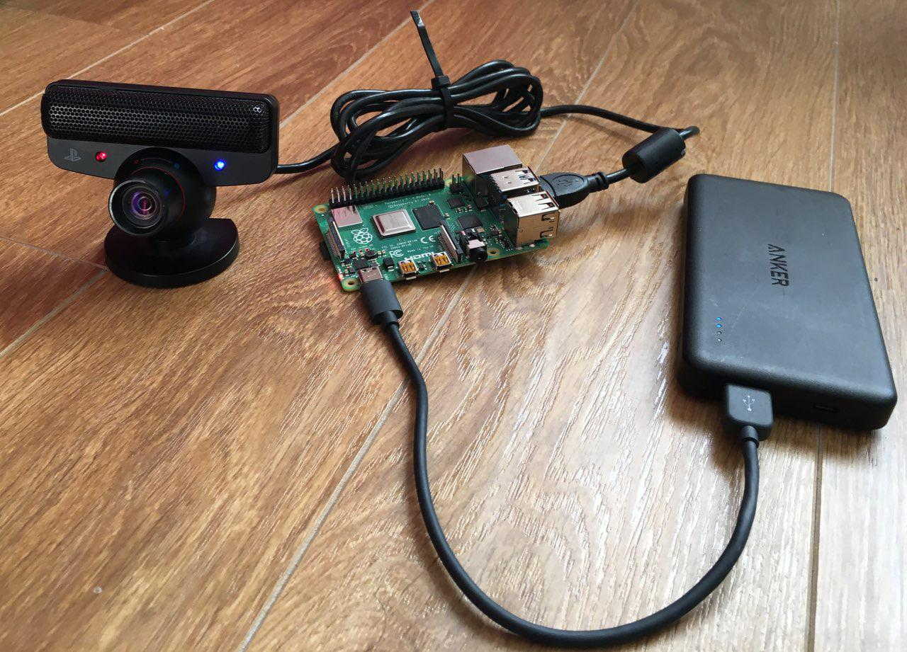

# Embedded Vision Framework

## Why?

I couldn't find an easy way to develop real time image processing code on an embedded linux device (Raspberry Pi etc.) without connecting a mouse, keyboard and monitor. Most people develop and monitor their code on the embedded system just for the ease of the onboard desktop environment but this is not a way to go for me. 

This opinionated example allows you to develop the code on your host computer, compile and run at the embedded device and finally analyse and interact with the operation visually on your host computer.

I tested this example on a Raspberry Pi 4 and with its onboard Wi-Fi capability, you can create a totally wireless image processing system that you can develop, debug, visualise and interact with remotely.

## Test Setup

## Test Video

[https://vimeo.com/346560699](https://vimeo.com/346560699)

## Steps for imgrab example

* Use ssh to connect to remote device terminal. Compile and run the code with desired arguments.
* Use [sshfs](https://github.com/libfuse/sshfs) to mirror the remote codebase folder into your local computer. Develop on your host computer with the IDE / text editor of your choice.
* Use ./tools/imgrab_client.py script on your host computer to retrieve the real time vision data. Also you can use this script to send keyboard and mouse click events for visually interacting with the code running on the embedded device.
* To demonstrate the real time interaction capability, the example allows you to draw a rectangle on top of the webcam stream with mouse click events you create on your host computer.

## Notes

* Uses [zeromq](http://zeromq.org/) for command passing and video transmition network interface.
* Live video data is JPEG compressed to reduce data bandwith requirement.
    - Please be aware that the image processing run on the uncompressed raw video stream, system compresses the frames just to send to host for visualisation.
* Command data is serialized with JSON.
* Uses PS3 Eye camera and includes neccessary drivers. You can use any other camera as well.
* Uses [https://github.com/nlohmann/json](https://github.com/nlohmann/json) library in the embedded code for JSON decoding.
* Uses [pygame](https://www.pygame.org/news) in the host script for visualisation and event handling.
* Uses [opencv](https://opencv.org/) in the host script for JPEG encoding.
* Uses [opencv](https://opencv.org/) in the embedded code for the processing.